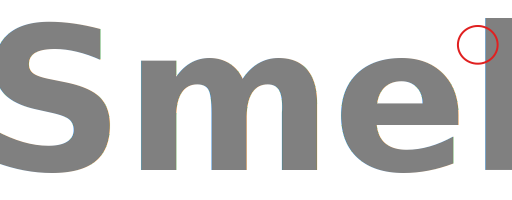
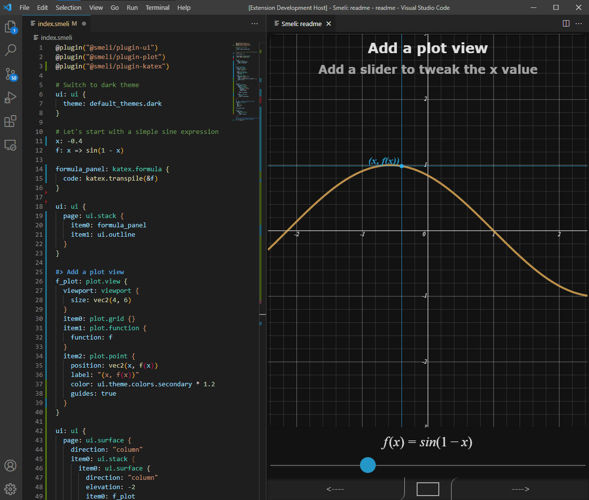

# About

Smeli is a domain-specific language designed to explain, present and teach reasoning. It is also efficient at prototyping small, dedicated, web-based interactive tools.

# Language

Smeli stands for 'Self-Modifying Expression Language for Interactivity', let's explain these words in more details.

## Expressions

The major difference between Smeli and other commonly-used programming languages is the way expressions are handled.

In a traditionnal language, when you write something like this

```
a = b + 10
```

Usually, it means "compute the value of b, add 10, then store it in variable a".

The equivalent Smeli expression looks like this, with a major difference in meaning:

```
a: b + 10
```

This will bind the _expression_ `b + 10` to the name `a`, independently from the _value_ of `b` in the past, present or future.

As long as this expression is bound to `a`, you can think of `a` being automatically recalculated every time `b` changes (more specifically, Smeli follows an _implicit evaluation model_).

## Execution model

Everything in Smeli is designed so that your source code matches your _train of thoughts_.

Each line is a step in your reasoning process, and because reasoning is an iterative process, Smeli supports both re-binding names to new expressions, and seamless execution of the code **forwards** and **backwards**.

Let's look at a more comprehensive example:


([full version](https://github.com/smeli-lang/smeli/tree/master/samples/readme))

You may have noticed the special _marker comment_, starting with `#>`. This can be used to control execution flow.

For instance, it is very easy to use a slide clicker to go directly to the next or previous marker comment, and everything on screen will update accordingly.

## Interactivity

In the previous example, we bound a slider object from the ui plugin. This is a good example of how Smeli manages interaction and side-effects.

All Smeli expressions are strictly pure from a mathematical point of view. That allows to define clean relationships between the various parts of your models.

Plugins, however, can trigger side-effects on expression evaluation (to update the UI, for instance). They can also inject new expression bindings when required (typically for user interaction).

This hybrid model allows the Smeli code to remain clean and maintainable, while plugins are free to create a rich user experience without the constraint of purity, as long as they behave _as if_ everything is pure from the interpreter point of view.

# Getting started

The easiest way to get started is to try the sandbox (TODO).

For a more complete development environment, check out the [VS Code plugin](https://github.com/smeli-lang/smeli/tree/master/extensions/vscode-smeli).

# License

Smeli, and its official plugins, are all licensed under the MIT license.

Other community plugins, and projects written in the Smeli language are free to use any license of their choosing and are not subject to the terms of this repository.

# Authors

Smeli was created by Rémi Papillié (@wsmind), and maintained, enhanced and extended by many contributors. (TODO authors link)
